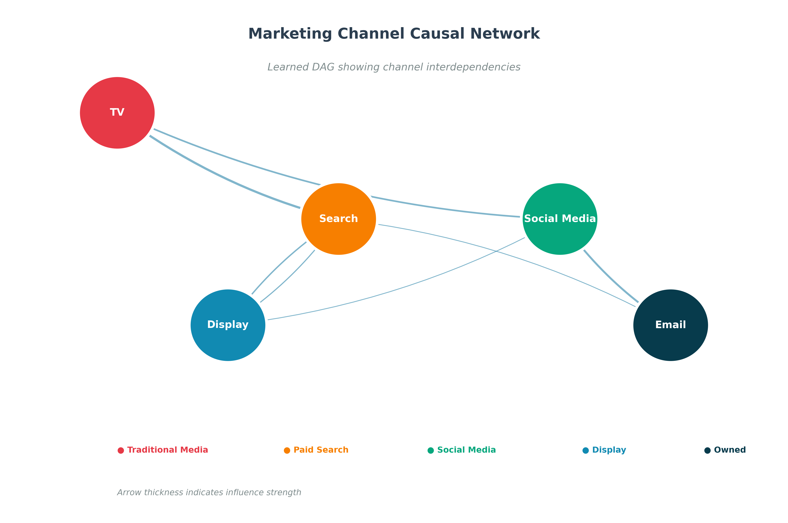
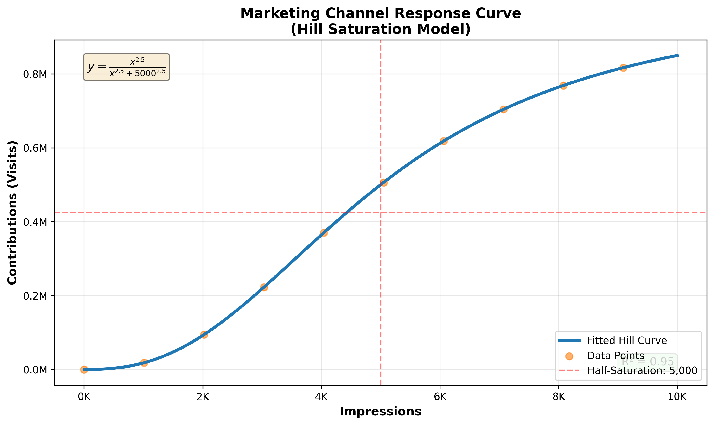

# Summary

Marketing Mix Modeling (MMM) is a statistical technique used to estimate the impact of marketing activities on business outcomes such as sales, revenue, or customer visits. Traditional MMM approaches often rely on linear regression or Bayesian hierarchical models that assume independence between marketing channels and struggle to capture complex temporal dynamics and non-linear saturation effects [@Hanssens2005; @Ng2021Bayesian].

**DeepCausalMMM** is a Python package that addresses these limitations by combining deep learning, causal inference, and advanced marketing science. The package uses Gated Recurrent Units (GRUs) to automatically learn temporal patterns such as adstock (carryover effects) and lag, while simultaneously discovering causal relationships between marketing channels through Directed Acyclic Graph (DAG) learning [@Zheng2018NOTEARS; @Gong2024CausalMMM]. Additionally, it implements Hill equation-based saturation curves to model diminishing returns and optimize budget allocation.

Key innovations include: (1) a "zero hardcoding" philosophy where all model parameters are learned from data rather than manually specified, (2) multi-region modeling with both shared and region-specific parameters, (3) robust statistical methods including Huber loss and advanced regularization, (4) comprehensive response curve analysis for understanding channel saturation, and (5) an extensive visualization suite with 14+ interactive dashboards for business insights.

# Statement of Need

Marketing organizations invest billions annually in advertising across channels (TV, digital, social, search), yet measuring ROI remains challenging due to: (1) temporal complexity with delayed and persistent effects [@Hanssens2005], (2) channel interdependencies [@Gong2024CausalMMM], (3) non-linear saturation with diminishing returns [@Li2024Survey], (4) regional heterogeneity, and (5) multicollinearity between campaigns.

**DeepCausalMMM** addresses these challenges by combining GRU-based temporal modeling, causal structure discovery via DAG learning, Hill equation response curves, multi-region modeling, production-ready performance (93% holdout R², 3.6% train-test gap), and zero-hardcoding for generalizability.

# State of the Field

Several open-source MMM frameworks exist, each with distinct approaches:

**Robyn (Meta)** [@Runge2024RobynPackaging; @RobynGitHub] uses Bayesian hyperparameter optimization with fixed adstock and saturation transformations (Adstock, Hill, Weibull). It provides budget optimization and is widely used in industry but requires manual specification of transformation types and does not model channel interdependencies.

**LightweightMMM (Google)** [@LightweightMMM2022] implements Bayesian MMM using JAX and Numpyro, offering probabilistic inference with flexible priors. It supports adstock effects and budget optimization but does not incorporate causal graph learning or deep learning for temporal dynamics.

**PyMC-Marketing** [@PyMCMarketing2024] provides Bayesian MMM with highly flexible prior specifications and some causal identification capabilities. It excels at uncertainty quantification but requires significant Bayesian modeling expertise and does not use neural networks for temporal modeling.

**CausalMMM** [@Gong2024CausalMMM] introduces neural networks and causal graph learning to MMM, demonstrating the value of discovering channel interdependencies. However, it does not provide multi-region modeling, comprehensive response curve analysis, or the extensive visualization and analysis tools needed for practical deployment.

**DeepCausalMMM** advances the field by integrating: (1) GRU-based temporal modeling, (2) DAG causal discovery [@Zheng2018NOTEARS], (3) Hill equation response curves, (4) multi-region modeling, (5) robust statistical methods, (6) production-ready architecture, and (7) comprehensive visualization suite.

# Functionality

## Core Architecture

**Temporal Modeling**: A GRU network automatically learns adstock effects, lag patterns, and time-varying coefficients.

**Causal Discovery**: The model learns a DAG representing channel interdependencies using continuous optimization [@Zheng2018NOTEARS].

**Saturation Modeling**: Hill transformation captures diminishing returns: $y = \frac{x^a}{x^a + g^a}$ where $a$ controls S-curve steepness and $g$ is the half-saturation point. The model enforces $a \geq 2.0$ for proper saturation.

**Multi-Region Support**: Handles multiple geographic regions with region-specific baselines, shared temporal patterns, and learnable scaling factors.

## Response Curve Analysis

The `ResponseCurveFit` module fits Hill equations to channel data, identifies saturation points, provides interactive visualizations, and enables budget optimization.

## Statistical Robustness

The package implements Huber loss (outlier-robust), gradient clipping, L1/L2 regularization with sparsity control, learnable coefficient bounds, and burn-in periods for GRU stabilization.

## Implementation Details

- **Language**: Python 3.9+, **Deep Learning**: PyTorch 2.0+
- **Data Processing**: pandas, NumPy, **Optimization**: scipy, scikit-learn
- **Visualization**: Plotly, NetworkX, **Statistical Methods**: statsmodels
- **Installation**: `pip install deepcausalmmm`
- **Documentation**: [https://deepcausalmmm.readthedocs.io](https://deepcausalmmm.readthedocs.io)
- **Tests**: 28 comprehensive tests with 100% pass rate
- **Visualizations**: 14+ interactive Plotly dashboards exportable as HTML

## Visualizations

Figure 1 shows an example of the learned causal network (DAG) between marketing channels. The directed edges reveal interdependencies such as TV advertising driving search behavior, demonstrating the model's ability to discover channel relationships from data.



Figure 2 demonstrates a non-linear response curve fitted to a marketing channel using the Hill equation. The S-shaped curve clearly shows saturation effects and diminishing returns, with annotations indicating the half-saturation point where the channel reaches 50% of maximum effectiveness.



# Example Usage

```python
import pandas as pd
from deepcausalmmm.core import get_default_config
from deepcausalmmm.core.trainer import ModelTrainer
from deepcausalmmm.core.data import UnifiedDataPipeline

# Load and process data
df = pd.read_csv('mmm_data.csv')
config = get_default_config()
pipeline = UnifiedDataPipeline(config)
processed_data = pipeline.fit_transform(df)

# Train model
trainer = ModelTrainer(config)
model, results = trainer.train(processed_data)
print(f"Holdout R²: {results['holdout_r2']:.3f}")

# Response curve analysis
from deepcausalmmm.postprocess import ResponseCurveFit
fitter = ResponseCurveFit(data=channel_data, model_level='Overall')
fitter.fit(save_figure=True, output_path='response_curve.html')
print(f"Slope: {fitter.slope:.3f}, Saturation: {fitter.saturation:,.0f}")
```

# Performance

DeepCausalMMM has demonstrated strong performance on masked real-world marketing data containing 190 geographic regions (DMAs), 109 weeks of observations, 13 marketing channels, and 7 control variables:

- **Training R²**: 0.965, **Holdout R²**: 0.930
- **Performance Gap**: 3.6% (indicating excellent generalization)
- **Training RMSE**: 254,911 KPI units (34.7% error)
- **Holdout RMSE**: 324,584 KPI units (38.7% error)

These results demonstrate the model's ability to capture complex marketing dynamics while maintaining strong out-of-sample predictive accuracy. The small performance gap between training and holdout sets indicates robust generalization without overfitting.

# Reproducibility

DeepCausalMMM ensures reproducible results through deterministic training with configurable random seeds, comprehensive test suite (28 tests), example notebooks, detailed documentation of hyperparameters, and version-controlled releases with semantic versioning.

# Research and Practical Applications

**Industry Applications**: Budget optimization across marketing channels, ROI measurement and attribution, strategic planning and forecasting, channel effectiveness analysis, regional marketing strategy development.

**Research Applications**: Causal inference in marketing, temporal dynamics in advertising, multi-region heterogeneity, saturation modeling, and channel interdependencies.

The zero-hardcoding philosophy and comprehensive documentation make it accessible to practitioners while rigorous statistical foundations support academic research.

# Acknowledgments

We acknowledge the contributions of the open-source community, particularly the developers of PyTorch, pandas, and scikit-learn, which form the foundation of this package. We also thank the MMM research community for establishing the theoretical foundations that informed this work.

# References