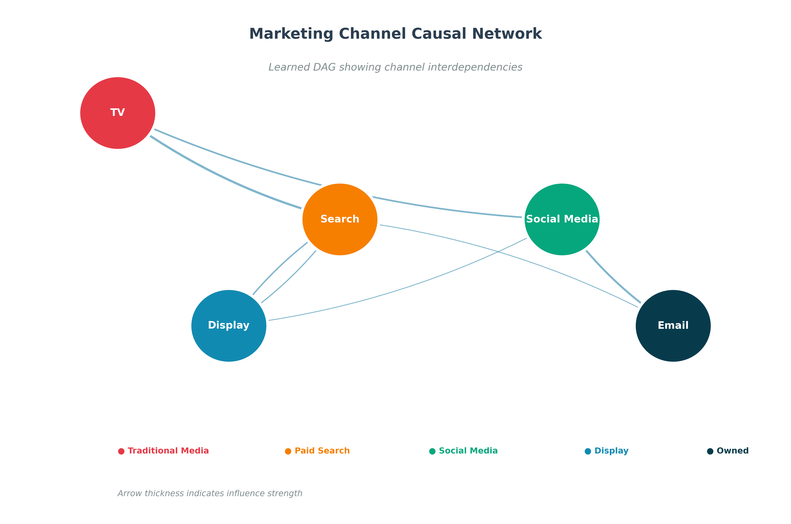
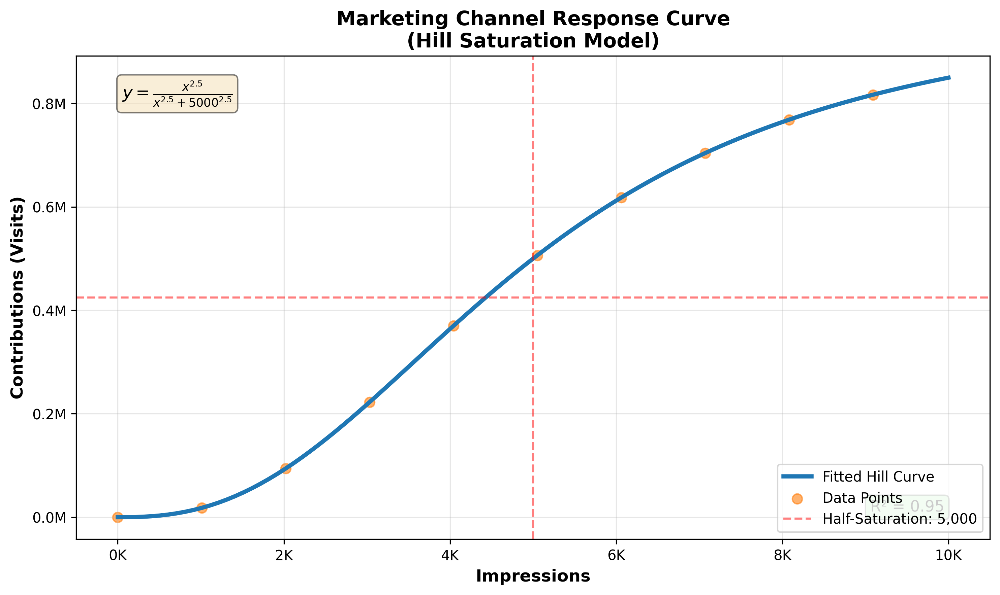

# Summary

Marketing Mix Modeling (MMM) estimates the impact of marketing activities on business outcomes such as sales or revenue. Traditional MMM approaches rely on linear regression or Bayesian hierarchical models that assume channel independence and struggle to capture temporal dynamics and non-linear saturation [@Chan2017; @Hanssens2005; @Ng2021Bayesian].

**DeepCausalMMM** addresses these limitations by combining deep learning, causal inference, and marketing science. It uses Gated Recurrent Units (GRUs) to learn temporal patterns (adstock, lag) while learning statistical dependencies between channels through Directed Acyclic Graph (DAG) structure with upper triangular constraints [@Zheng2018NOTEARS; @Gong2024CausalMMM]. It implements Hill equation saturation curves for diminishing returns and budget optimization.

Key features: (1) data-driven hyperparameters learned from data with defaults, (2) linear mean scaling of the dependent variable, (3) configurable attribution priors with dynamic loss scaling, (4) multi-region modeling with shared and region-specific parameters, (5) robust methods including Huber loss, (6) response curve analysis.

# Statement of Need

Marketing organizations invest billions annually in advertising across channels (TV, digital, social, search), yet measuring ROI remains challenging due to: (1) temporal complexity with delayed and persistent effects [@Hanssens2005], (2) channel interdependencies [@Gong2024CausalMMM], (3) non-linear saturation with diminishing returns [@Li2024Survey], (4) regional heterogeneity, and (5) multicollinearity between channels.

**DeepCausalMMM** addresses these challenges by combining GRU-based temporal modeling on adstocked data, DAG-based structure learning, Hill equation response curves, multi-region modeling, performance measured under temporal holdout evaluation, attribution through configurable prior regularization, and data-driven hyperparameter learning for generalizability.

# State of the Field

Several open-source MMM frameworks exist, each with distinct approaches:

**Robyn (Meta)** [@Runge2024RobynPackaging; @RobynGitHub] uses evolutionary hyperparameter optimization with fixed adstock and saturation transformations (Adstock, Hill, Weibull). It provides budget optimization and is widely used in industry but requires manual specification of transformation types and does not model channel interdependencies.

**Meridian (Google)** [@Meridian2024] is Google's open-source Bayesian MMM framework featuring reach and frequency modeling, geo-level analysis, and experimental calibration. It employs causal inference with pre-specified causal graphs and the backdoor criterion.

**PyMC-Marketing** [@PyMCMarketing2024] provides Bayesian MMM with highly flexible prior specifications and some causal identification capabilities. It excels at uncertainty quantification but requires significant Bayesian modeling expertise and does not use neural networks for temporal modeling.

**CausalMMM** [@Gong2024CausalMMM] introduces neural networks and graph learning to MMM, demonstrating the value of discovering channel interdependencies. However, it does not provide multi-region modeling or comprehensive response curve analysis.

**DeepCausalMMM** advances the field by integrating: (1) GRU-based temporal modeling, (2) DAG-based structure learning using upper triangular constraints [@Zheng2018NOTEARS], (3) Hill equation response curves, (4) multi-region modeling, (5) robust statistical methods. DeepCausalMMM is complementary to Bayesian MMM frameworks, prioritizing scalability, and automated structure discovery.

# Software Design

DeepCausalMMM's architecture reflects several key design decisions driven by the unique challenges of marketing mix modeling:

**Neural Architecture**: GRUs were selected over LSTMs and Transformers, providing sufficient temporal modeling while reducing overfitting risk on typical MMM datasets (50-200 weeks).

**DAG Structure Learning**: We adopt an upper triangular adjacency matrix to enforce acyclicity, prioritizing computational efficiency and training stability for production applications. Full NOTEARS implementation is planned for future releases.

**Saturation Function**: Hill equation with constraints ($a \geq 2.0$) reflects marketing science domain knowledge of S-curve diminishing returns, improving generalization and interpretability.

**Multi-Region Modeling**: Shared temporal dynamics (GRU weights) with region-specific baselines balance the bias-variance trade-off. This design is conceptually analogous to hierarchical Bayesian MMMs commonly used in practice. 

**Robustness**: Huber loss addresses marketing data outliers (promotional spikes, data quality issues) while maintaining differentiability. Gradient clipping and L1/L2 regularization ensure stable training.

**Mean Scaling**: We normalize the dependent variable by its region-specific mean ($y / \bar{y}_r$), analogous to index-number normalization commonly used in econometric decomposition models. This transformation preserves relative marginal effects while enforcing scale invariance across regions, allowing model components to form an exactly additive decomposition that sums to 100% when rescaled to original units.

**Attribution Prior Regularization**: Configurable priors with dynamic loss scaling prevent unrealistic distributions (e.g., >90% media contribution), addressing neural MMM's tendency toward business-illogical attributions.

**Data-Driven Hill Initialization**: Hill parameters are initialized from channel-specific SOV percentiles, enabling discovery of channel-specific saturation behaviors.

**Modular Post-Processing**: Decoupled response curve analysis enables budget optimization without retraining.

These design decisions enable interpretable, tractable real-world marketing applications.

## Implementation Details

- **Language**: Python 3.9+, **Deep Learning**: PyTorch 2.0+
- **Data Processing**: pandas, NumPy, **Optimization**: scipy, scikit-learn
- **Visualization**: Plotly, NetworkX, **Statistical Methods**: statsmodels
- **Installation**: `pip install deepcausalmmm`
- **Documentation**: [https://deepcausalmmm.readthedocs.io](https://deepcausalmmm.readthedocs.io)
- **Tests**: Comprehensive unit and integration test suite in `tests/` directory
- **Versioning**: The package follows [semantic versioning](https://semver.org/). **Breaking changes** are recorded in the changelog—**v1.0.19** introduced a revised linear scaling and attribution stack relative to **v1.0.18 and earlier** (see README and CHANGELOG for migration notes).

## Visualizations

Figure 1 shows an example of the learned DAG structure between marketing channels. The directed edges reveal statistical dependencies consistent with plausible causal pathways, such as TV advertising's association with search behavior, demonstrating the model's ability to discover channel interdependencies from data.



Figure 2 demonstrates a non-linear response curve fitted to a marketing channel using the Hill equation. The S-shaped curve clearly shows saturation effects and diminishing returns, with annotations indicating the half-saturation point where the channel reaches 50% of maximum effectiveness.



# Example Usage

```python
import numpy as np
from deepcausalmmm.core import get_default_config
from deepcausalmmm.core.trainer import ModelTrainer
from deepcausalmmm.core.data import UnifiedDataPipeline

# Generate sample MMM data
np.random.seed(42)
n_regions, n_weeks = 10, 52  # 10 regions, 52 weeks
n_media, n_control = 5, 3    # 5 media channels, 3 controls

# Media spend/impressions [regions, weeks, channels]
X_media = np.random.uniform(100, 5000, (n_regions, n_weeks, n_media))
# Control variables [regions, weeks, controls]
X_control = np.random.uniform(0, 1, (n_regions, n_weeks, n_control))
# Target (sales/KPI) [regions, weeks]
y = np.random.uniform(1000, 10000, (n_regions, n_weeks))

# Configure and initialize pipeline
config = get_default_config()
pipeline = UnifiedDataPipeline(config)

# Split data temporally (train/holdout)
train_data, holdout_data = pipeline.temporal_split(X_media, X_control, y)
train_tensors = pipeline.fit_and_transform_training(train_data)
holdout_tensors = pipeline.transform_holdout(holdout_data)

# Create and train model
trainer = ModelTrainer(config)
model = trainer.create_model(
    n_media=train_tensors['X_media'].shape[2],
    n_control=train_tensors['X_control'].shape[2],
    n_regions=train_tensors['X_media'].shape[0]
)
trainer.create_optimizer_and_scheduler()

# Train with train and holdout data
results = trainer.train(
    train_tensors['X_media'], train_tensors['X_control'],
    train_tensors['R'], train_tensors['y'],
    holdout_tensors['X_media'], holdout_tensors['X_control'],
    holdout_tensors['R'], holdout_tensors['y'],
    pipeline=pipeline,
    verbose=True
)

# Results
print(f"Training R²: {results['final_train_r2']:.3f}")
print(f"Holdout R²: {results['final_holdout_r2']:.3f}")
print(f"Training RMSE original scale: {results['final_train_rmse']:.0f}")
print(f"Holdout RMSE original scale: {results['final_holdout_rmse']:.0f}")
```

# Performance

Results use `examples/data/MMM Data.csv` (190 DMAs × 109 weeks, 13 channels, 7 controls; no PII) with `holdout_ratio = 0.12` in `examples/pymc_aligned_dcm_config.json`—about **96** train and **13** holdout weeks of observed time (burn-in padding may apply; see pipeline logs).

**Table 1** comes from `examples/mmm_three_way_benchmark.ipynb`: same CSV and split, **sklearn** R²/RMSE (original scale, pooled), and execution time. **PyMC-Marketing** [@PyMCMarketing2024], **Meridian** [@Meridian2024], and **national weekly Ridge** on Robyn-style inputs [@Runge2024RobynPackaging] (not Meta’s full Robyn unless `robynpy` is enabled). Bayesian runs use modest MCMC budgets in the notebook.

| Method | Scope | Train R² | Holdout R² | Holdout RMSE | Execution time (s) |
|--------|-------|----------|------------|--------------|---------------------|
| National weekly Ridge (Robyn-style inputs) | National, weekly | 0.856 | −12.43 | 1.7 × 10⁷ | <1 |
| DeepCausalMMM (dashboard training path) | Panel, geo×week | 0.949 | 0.843 | 5.3 × 10⁵ | 489 |
| PyMC-Marketing MMM | Panel, geo×week | 0.994 | 0.903 | 4.8 × 10⁵ | 5995 |
| Meridian | Panel, geo×week | 0.997 | −10.05 | 5.1 × 10⁶ | 479 |

On this dataset, **Meridian** reaches the **highest train R²** in Table 1 but **very poor holdout** R² and RMSE—a **large train–holdout gap** under the notebook’s modest MCMC settings; that pattern signals weak out-of-sample fit **here**, not a universal statement about the library. **PyMC-Marketing** delivers the **strongest holdout** R²/RMSE among the panel rows, with the **longest** execution time. **DeepCausalMMM** is **much faster** than PyMC in this run while keeping **stable positive holdout** performance (~0.84 R²), so it occupies a different point on the **speed–accuracy** tradeoff for this panel; it does **not** beat PyMC on raw holdout in the table. The **national Ridge** row is not comparable to panel rows by R² alone. `examples/dashboard_rmse_optimized.py` gives **Training R² ≈ 0.95**, **Holdout R² ≈ 0.84**, ~**11** pp gap—aligned with Table 1.

# Research Impact Statement

DeepCausalMMM fills a **PyTorch-oriented** niche: installable **multi-region** MMM with **holdouts**, **Hill saturation**, and **upper-triangular** channel coupling, **alongside** mainstream Bayesian tools (PyMC-Marketing, Meridian). **Table 1** and the benchmark notebook provide a **shared reference** on one public panel (DeepCausalMMM ≈ **0.84** holdout R², ≈ **11** pp train–holdout gap). **Near-term significance**—with community evidence still **early**—comes from **PyPI**, **Zenodo** DOI (metadata), **Read the Docs**, and **CI** for Python **3.9–3.13**, which lower the barrier to **try, reproduce, and extend** the software; **citations and course adoption** remain limited, and **private industry results are not reported**. **Practitioners** on Python DL stacks and **researchers** needing a reproducible baseline benefit most.

# Reproducibility

DeepCausalMMM supports reproducible training and evaluation via deterministic random seeds, versioned configurations, and a unit/integration test suite.

The repository ships `examples/data/MMM Data.csv`, `examples/dashboard_rmse_optimized.py` (metrics, DAG, response curves), and `examples/mmm_three_way_benchmark.ipynb` (**Table 1**; optional deps in the notebook).

To reproduce the **DeepCausalMMM dashboard** metrics:

```bash
git clone https://github.com/adityapt/deepcausalmmm.git
cd deepcausalmmm
pip install -e .
python examples/dashboard_rmse_optimized.py
```

The script uses the default configuration from `deepcausalmmm/core/config.py` and outputs results to `dashboard_outputs/`.

# Research and Practical Applications

**Industry Applications**: Budget optimization across marketing channels, ROI measurement and attribution, strategic planning and forecasting, channel effectiveness analysis, regional marketing strategy development.

**Research Applications**: Causal reasoning and structure discovery in marketing, temporal dynamics in advertising, multi-region heterogeneity, saturation modeling, and channel interdependencies.

The data-driven hyperparameter learning and comprehensive documentation make it accessible to practitioners while the statistical foundations support academic research.

# Acknowledgments

The author acknowledges the contributions of the open-source community, particularly the developers of PyTorch, pandas, and scikit-learn, which form the foundation of this package. The author also thanks the MMM research community for establishing the theoretical foundations that informed this work.

This work received no specific external funding, and no sponsor had any role in the design, implementation, or reporting of this software.

# AI Usage Disclosure

The author used AI-assisted tools (including ChatGPT and Claude) during development for limited assistance with code drafting, debugging support, documentation editing, and manuscript drafting. All AI-assisted outputs were reviewed, verified, and substantially edited by the author. The author takes full responsibility for the software, analyses, and all claims in this manuscript.

# Conflict of Interest and Provenance

The author declares no competing financial or non-financial interests that could inappropriately influence this work.

This work was conducted independently by the author and does not represent the views of any employer.

# References
